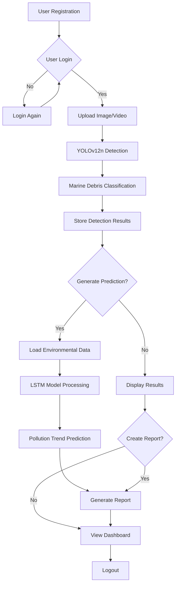
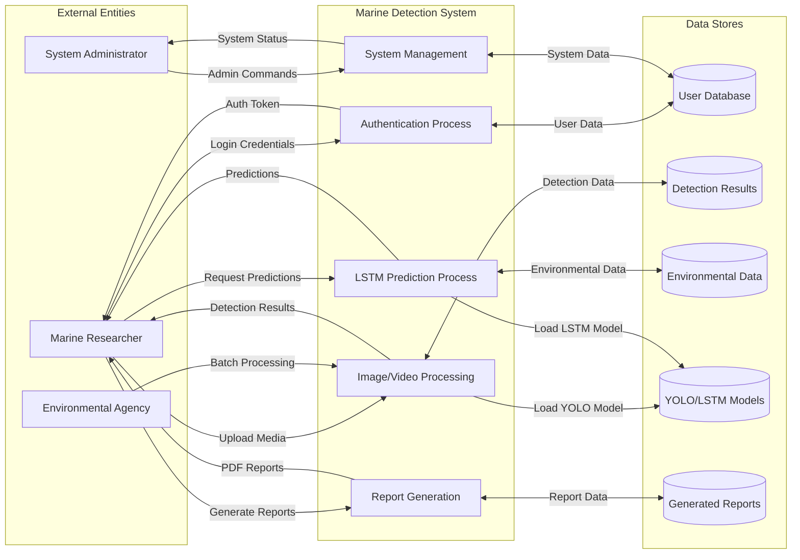
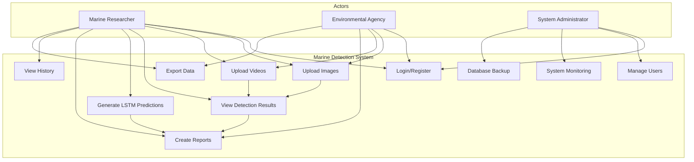
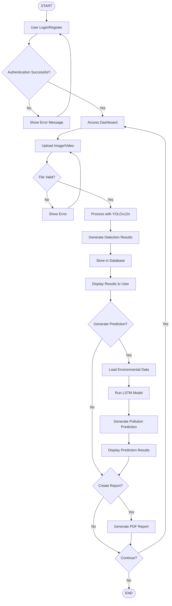
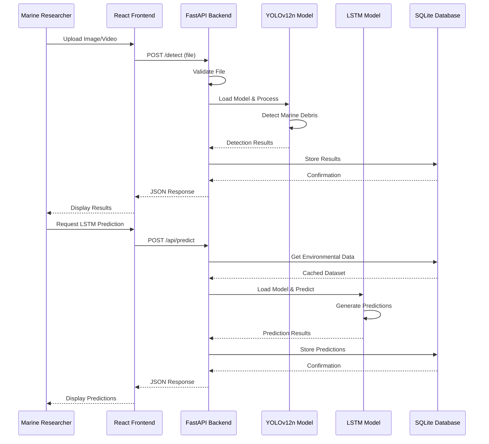

# Software Requirements Specification (SRS)
## AI-Powered Detection and Analysis of Marine Plastic Pollution

**Project Title:** AI-Powered Detection and Analysis of Marine Plastic Pollution  
**Project Level:** BS-CS Final Year Project (HITEC University)  
**Document Version:** 1.0  
**Date:** January 20, 2026  
**Team:** Touseef Ur Rehman, Qasim Shahzad, Zohaib Ashraf  

---

## 1. Purpose

This Software Requirements Specification (SRS) document defines the functional and non-functional requirements for the AI-Powered Marine Plastic Pollution Detection and Analysis System. The system is designed to automatically detect and classify marine plastic pollution in images and videos using advanced computer vision techniques, specifically YOLOv12 object detection, and predict pollution trends using LSTM neural networks.

The primary purpose is to provide marine researchers, environmental agencies, and conservation organizations with an automated tool for monitoring and analyzing marine plastic pollution patterns, enabling data-driven decision making for ocean conservation efforts.

## 2. Scope

The Marine Detection System encompasses:

**In Scope:**
- Real-time detection and classification of marine plastic pollution in images and videos
- LSTM-based pollution trend prediction across multiple marine regions
- User authentication and role-based access control (USER/ADMIN)
- Interactive web-based dashboard for data visualization and analysis
- Comprehensive reporting system with PDF generation capabilities
- Administrative tools for system monitoring and user management
- Database management for detection history and analytics
- Environmental data integration for enhanced prediction accuracy

**Out of Scope:**
- Real-time video streaming from underwater cameras
- Mobile application development
- Integration with external IoT sensors
- Automated drone control systems
- Real-time API calls to external weather services during prediction

## 3. Overall Description

### 3.1 Product Perspective

The Marine Detection System is a standalone full-stack web application that operates independently without external dependencies during core operations. The system integrates multiple AI/ML components:

- **Frontend:** React 18 + TypeScript web application with responsive design
- **Backend:** FastAPI Python server with RESTful API architecture
- **Database:** SQLite database with 10 optimized tables for data persistence
- **AI Models:** YOLOv12n for object detection and LSTM networks for time-series prediction
- **Authentication:** JWT-based security with role-based access control

### 3.2 Product Functions

**Core Functions:**
1. **Object Detection:** Automated detection of 22 marine classes including plastic debris, marine life, and equipment
2. **Video Processing:** Frame-by-frame analysis of underwater videos with progress tracking
3. **Pollution Prediction:** LSTM-based forecasting for 4 marine regions (Pacific, Atlantic, Indian, Mediterranean)
4. **User Management:** Registration, authentication, and profile management
5. **Data Visualization:** Interactive charts, heatmaps, and statistical dashboards
6. **Report Generation:** Automated PDF reports with detection summaries and analytics
7. **Administrative Control:** System monitoring, user management, and maintenance tools

### 3.3 User Classes and Characteristics

**Primary Users:**
1. **Marine Researchers (USER Role)**
   - Upload and analyze marine imagery/videos
   - Generate pollution trend predictions
   - Create and download analytical reports
   - View detection history and statistics

2. **System Administrators (ADMIN Role)**
   - Monitor system performance and usage
   - Manage user accounts and permissions
   - Perform system maintenance and backups
   - Access comprehensive system logs

3. **Environmental Agencies (USER Role)**
   - Batch process large datasets
   - Generate compliance reports
   - Monitor pollution trends across regions

### 3.4 Operating Environment

**Hardware Requirements:**
- **Minimum:** 4GB RAM, 2-core CPU, 5GB storage
- **Recommended:** 8GB RAM, 4-core CPU, 20GB storage
- **GPU:** Optional for enhanced processing speed

**Software Environment:**
- **Operating System:** Windows 10+, macOS 10.15+, Ubuntu 18.04+
- **Python:** 3.8+ with pip package manager
- **Node.js:** 16+ with npm
- **Web Browser:** Chrome 90+, Firefox 88+, Safari 14+

**Network Requirements:**
- Local network access for web interface
- Internet connection for initial model downloads and environmental data caching

### 3.5 Design and Implementation Constraints

**Technical Constraints:**
- SQLite database limitations (suitable for 1-5 concurrent users)
- YOLOv12n model requires pre-trained weights file (best.pt)
- LSTM models trained on cached datasets only
- Video processing limited by available system memory

**Regulatory Constraints:**
- Data privacy compliance for user information
- Environmental data usage within API rate limits
- Academic use licensing for research purposes

**Performance Constraints:**
- Image detection: 2-5 seconds per image
- Video processing: Real-time frame analysis capability
- Concurrent user limit: 1-5 users for optimal performance

## 4. System Features

### 4.1 Authentication Module

**Description:** Secure user authentication and authorization system with JWT tokens.

**Functional Requirements:**
- User registration with email validation
- Secure login with password hashing (SHA-256 with salt)
- JWT token-based session management (24-hour expiration)
- Role-based access control (USER/ADMIN)
- Password change and profile management
- Automatic session cleanup

**Priority:** High

### 4.2 Object Detection Module

**Description:** YOLOv12n-powered detection system for marine plastic pollution identification.

**Functional Requirements:**
- Support for multiple image formats (JPEG, PNG, WebP)
- Video processing with frame-by-frame analysis
- Adjustable confidence threshold (0.01-1.0)
- Real-time progress tracking with animated indicators
- Batch processing capabilities
- Annotated result generation with bounding boxes
- Detection of 22 marine classes including plastic debris

**Priority:** High

### 4.3 LSTM Prediction Module

**Description:** Time-series forecasting system for pollution trend prediction.

**Functional Requirements:**
- Multi-region support (Pacific, Atlantic, Indian, Mediterranean)
- 7-90 day prediction range with confidence intervals
- Environmental data integration (temperature, humidity, AQI, etc.)
- Model training interface with epoch control
- Synthetic data generation for training enhancement
- Prediction accuracy tracking and validation

**Priority:** High

### 4.4 Data Visualization Module

**Description:** Interactive dashboard for data analysis and visualization.

**Functional Requirements:**
- Interactive charts using Recharts library
- Pollution heatmaps with Leaflet mapping integration
- Statistical dashboards with key performance metrics
- Historical trend analysis
- Before/after comparison sliders
- Export capabilities for charts and data

**Priority:** Medium

### 4.5 Reporting Module

**Description:** Comprehensive reporting system with automated PDF generation.

**Functional Requirements:**
- Auto-generated PDF reports with detection summaries
- Custom report builder with date range selection
- Multiple export formats (CSV, JSON, PDF)
- Report history with download management
- Scheduled report generation (admin feature)
- Template-based report customization

**Priority:** Medium

### 4.6 Administrative Module

**Description:** System administration tools for monitoring and maintenance.

**Functional Requirements:**
- System statistics dashboard (users, detections, storage, uptime)
- User management (view, deactivate, role assignment)
- System maintenance tools (backup, cache clearing, DB optimization)
- Activity monitoring with real-time logs
- Storage analytics and usage tracking
- Data management (export, cleanup, archival)

**Priority:** Medium

## 5. Functional Requirements

### 5.1 User Authentication Requirements

**FR-1.1:** The system shall allow users to register with username, email, and password  
**FR-1.2:** The system shall authenticate users using JWT tokens with 24-hour expiration  
**FR-1.3:** The system shall support role-based access (USER/ADMIN)  
**FR-1.4:** The system shall hash passwords using SHA-256 with salt  
**FR-1.5:** The system shall automatically log out inactive sessions  

### 5.2 Object Detection Requirements

**FR-2.1:** The system shall detect objects in uploaded images within 5 seconds  
**FR-2.2:** The system shall process videos frame-by-frame with progress indication  
**FR-2.3:** The system shall support confidence threshold adjustment (0.01-1.0)  
**FR-2.4:** The system shall detect 22 marine classes including plastic debris  
**FR-2.5:** The system shall generate annotated images with bounding boxes  
**FR-2.6:** The system shall store detection results in the database  

### 5.3 LSTM Prediction Requirements

**FR-3.1:** The system shall predict pollution levels for 4 marine regions  
**FR-3.2:** The system shall provide predictions for 7-90 day ranges  
**FR-3.3:** The system shall integrate 10 environmental parameters  
**FR-3.4:** The system shall achieve 94%+ validation accuracy  
**FR-3.5:** The system shall generate confidence intervals for predictions  

### 5.4 Data Management Requirements

**FR-4.1:** The system shall store user data in SQLite database  
**FR-4.2:** The system shall maintain detection history per user  
**FR-4.3:** The system shall support data export in multiple formats  
**FR-4.4:** The system shall perform automatic database backups  
**FR-4.5:** The system shall implement data isolation between users  

### 5.5 Reporting Requirements

**FR-5.1:** The system shall generate PDF reports automatically  
**FR-5.2:** The system shall allow custom date range selection  
**FR-5.3:** The system shall include statistical summaries in reports  
**FR-5.4:** The system shall maintain report download history  
**FR-5.5:** The system shall support scheduled report generation  

### 5.6 Administrative Requirements

**FR-6.1:** The system shall provide admin dashboard with system statistics  
**FR-6.2:** The system shall allow user account management  
**FR-6.3:** The system shall support system maintenance operations  
**FR-6.4:** The system shall log all user activities  
**FR-6.5:** The system shall monitor storage usage and performance  

## 6. Non-Functional Requirements

### 6.1 Performance Requirements

**NFR-1.1:** Image detection shall complete within 5 seconds for images up to 10MB  
**NFR-1.2:** The system shall support 1-5 concurrent users without performance degradation  
**NFR-1.3:** Video processing shall maintain real-time frame analysis capability  
**NFR-1.4:** Database queries shall respond within 2 seconds for standard operations  
**NFR-1.5:** The web interface shall load within 3 seconds on standard broadband  

### 6.2 Accuracy Requirements

**NFR-2.1:** LSTM models shall achieve minimum 94% validation accuracy  
**NFR-2.2:** Object detection shall maintain confidence scores above configured threshold  
**NFR-2.3:** Prediction confidence intervals shall be statistically valid  
**NFR-2.4:** Detection results shall be reproducible with identical inputs  

### 6.3 Security Requirements

**NFR-3.1:** All passwords shall be hashed using SHA-256 with unique salts  
**NFR-3.2:** JWT tokens shall expire after 24 hours maximum  
**NFR-3.3:** User data shall be isolated between different user accounts  
**NFR-3.4:** All database queries shall use parameterized statements  
**NFR-3.5:** File uploads shall be validated for type and size limits  

### 6.4 Usability Requirements

**NFR-4.1:** The interface shall be responsive across desktop and mobile devices  
**NFR-4.2:** The system shall provide dark/light theme options  
**NFR-4.3:** Error messages shall be user-friendly and actionable  
**NFR-4.4:** The interface shall comply with accessibility standards  
**NFR-4.5:** Loading states shall be indicated with progress bars  

### 6.5 Scalability Requirements

**NFR-5.1:** The database schema shall support future feature additions  
**NFR-5.2:** The API shall be designed for potential horizontal scaling  
**NFR-5.3:** The system shall handle increasing data volumes gracefully  
**NFR-5.4:** Model architecture shall support additional marine classes  

## 7. Data Requirements

### 7.1 Image Datasets

**Primary Datasets:**
- **MARIDA Dataset:** Marine debris detection in satellite imagery
- **TACO Dataset:** Trash annotations in context for object detection
- **NOAA Marine Debris Dataset:** Underwater debris imagery
- **Custom Underwater Dataset:** Project-specific marine imagery

**Data Specifications:**
- **Formats:** JPEG, PNG, WebP
- **Resolution:** Minimum 640x640 pixels, maximum 4K
- **Size Limit:** 10MB per image file
- **Classes:** 22 marine categories including plastic debris, marine life, equipment

### 7.2 Video Data Handling

**Video Specifications:**
- **Formats:** MP4, AVI, MOV, WebM
- **Resolution:** 720p to 4K support
- **Frame Rate:** 15-60 FPS processing capability
- **Duration:** Up to 10 minutes per video
- **Processing:** Frame-by-frame analysis with progress tracking

### 7.3 Environmental and Temporal Data for LSTM

**Environmental Parameters (10 features):**
1. Temperature (°C)
2. Humidity (%)
3. Atmospheric Pressure (hPa)
4. Wind Speed (m/s)
5. Air Quality Index (AQI)
6. PM2.5 levels (μg/m³)
7. Ocean Temperature (°C)
8. Precipitation (mm)
9. Salinity (PSU)
10. Chlorophyll concentration (mg/m³)

**Temporal Data:**
- **Sequence Length:** 30 days historical data
- **Prediction Range:** 7-90 days ahead
- **Regions:** Pacific, Atlantic, Indian, Mediterranean
- **Data Source:** Cached datasets (no real-time API calls during training)

### 7.4 Database Schema

**Core Tables (10 tables):**
1. **users:** User authentication and profile data
2. **detections:** Detection metadata and results
3. **detection_results:** Individual object detection records
4. **videos:** Video-specific processing metadata
5. **images:** Image-specific processing metadata
6. **predictions:** LSTM prediction results
7. **reports:** Generated report metadata
8. **analytics_data:** Chart and visualization data
9. **logs:** System activity and audit logs
10. **sessions:** User session management

## 8. AI & ML Model Description

### 8.1 YOLOv12 Detection Pipeline

**Model Architecture:**
- **Base Model:** YOLOv12n (nano version for efficiency)
- **Input Size:** 640x640 pixels
- **Classes:** 22 marine categories
- **Confidence Threshold:** Adjustable 0.01-1.0
- **Processing Speed:** 2-5 seconds per image

**Detection Classes:**
- **Marine Life:** Crab, eel, fish, shells, starfish
- **Vegetation:** Marine plants and algae
- **Equipment:** ROV, underwater equipment
- **Plastic Debris:** Bags, bottles, containers, nets, ropes, microplastics
- **Other Debris:** Metal objects, glass, fabric

**Performance Metrics:**
- **Precision:** >85% for primary debris classes
- **Recall:** >80% for plastic pollution detection
- **Processing Time:** Real-time capability for video streams

### 8.2 LSTM-based Pollution Trend Prediction

**Model Architecture:**
- **Type:** Sequential LSTM with two hidden layers
- **Layer 1:** 64 LSTM units with return sequences
- **Layer 2:** 32 LSTM units
- **Dropout:** 0.2 rate for regularization
- **Output:** Single dense layer with linear activation

**Training Configuration:**
- **Sequence Length:** 30 days historical data
- **Features:** 10 environmental parameters
- **Batch Size:** 32 samples
- **Epochs:** 100 with early stopping
- **Validation Split:** 20% of training data
- **Optimizer:** Adam with 0.001 learning rate

**Performance Metrics:**
- **Validation Accuracy:** 94%+ achieved
- **Mean Absolute Error:** <5% for 7-day predictions
- **Confidence Intervals:** 95% statistical confidence
- **Regional Coverage:** 4 major marine regions

## 9. System Architecture Overview

The Marine Detection System follows a modern three-tier architecture with clear separation of concerns:

**Presentation Layer (Frontend):**
The React 18 + TypeScript frontend provides a responsive, accessible user interface with real-time updates. It communicates with the backend through RESTful APIs and manages client-side state using React Context and custom hooks. The interface supports both desktop and mobile devices with dark/light theme options.

**Application Layer (Backend):**
The FastAPI Python backend serves as the core processing engine, handling authentication, file processing, AI model inference, and business logic. It manages JWT-based authentication, processes uploaded media through the YOLOv12 detection pipeline, and coordinates LSTM predictions. The backend implements comprehensive error handling and logging for system monitoring.

**Data Layer (Database):**
SQLite database provides persistent storage with 10 optimized tables supporting user management, detection results, predictions, and system analytics. The database includes 13 performance indexes for efficient querying and automatic cleanup mechanisms for data maintenance.

**AI/ML Integration:**
YOLOv12n models are loaded at startup for real-time object detection, while LSTM models are dynamically loaded per region for pollution prediction. The system uses cached environmental datasets to avoid external API dependencies during model training and inference.

**Security Architecture:**
JWT tokens provide stateless authentication with role-based access control. All passwords are hashed using SHA-256 with unique salts, and database queries use parameterized statements to prevent SQL injection. User data isolation ensures privacy between different accounts.

---

## 10. System Diagrams

### 10.1 System Flowchart



This flowchart shows the main system workflow from user registration through marine debris detection, LSTM prediction, and report generation. The process follows a linear path with decision points for optional features like predictions and reports.

### 10.2 Data Flow Diagram (Level 0)



This Level 0 DFD shows the high-level data flows between external entities and the core system processes. Each process interacts with specific data stores, and data flows bidirectionally where appropriate for the marine detection system operations.

### 10.3 Use Case Diagram



The use case diagram shows the interactions between different user roles and system functionalities. Marine researchers have access to all detection and analysis features, environmental agencies can perform batch processing and reporting, while administrators manage system operations and user accounts.

### 10.4 Class Diagram

```mermaid
classDiagram
    class User {
        +int id
        +string username
        +string email
        +string password_hash
        +string role
        +datetime created_at
        +register()
        +login()
        +updateProfile()
    }
    
    class Detection {
        +int id
        +int user_id
        +string filename
        +string file_type
        +int total_detections
        +float confidence_threshold
        +datetime created_at
        +processImage()
        +processVideo()
        +getResults()
    }
    
    class DetectionResult {
        +int id
        +int detection_id
        +string class_name
        +float confidence
        +float bbox_x1
        +float bbox_y1
        +float bbox_x2
        +float bbox_y2
        +int frame_number
        +calculateArea()
    }
    
    class Prediction {
        +int id
        +int user_id
        +string region
        +date prediction_date
        +float pollution_level
        +float confidence_lower
        +float confidence_upper
        +datetime created_at
        +generatePrediction()
    }
    
    class Report {
        +int id
        +int user_id
        +string title
        +string report_type
        +string file_path
        +datetime created_at
        +generatePDF()
        +exportData()
    }
    
    class YOLOModel {
        +string model_path
        +list class_names
        +float confidence_threshold
        +loadModel()
        +detectObjects()
        +annotateImage()
    }
    
    class LSTMModel {
        +string region
        +int sequence_length
        +int n_features
        +loadModel()
        +predict()
        +trainModel()
    }
    
    User ||--o{ Detection : creates
    Detection ||--o{ DetectionResult : contains
    User ||--o{ Prediction : requests
    User ||--o{ Report : generates
    YOLOModel ||--|| Detection : processes
    LSTMModel ||--|| Prediction : generates
```

This class diagram represents the core entities and their relationships in the Marine Detection System. The User class is central, connected to Detection, Prediction, and Report classes. The AI models (YOLO and LSTM) process data to generate results that are stored in the database.

### 10.5 Activity Diagram



This activity diagram shows the complete user workflow from login through detection processing and optional prediction generation. The diagram includes decision points for error handling, optional features, and user choices to continue or exit the system.

### 10.6 Sequence Diagram



This sequence diagram demonstrates the interaction flow between system components during image detection and LSTM prediction operations. It shows the request-response pattern between frontend, backend, AI models, and database for both detection and prediction workflows.

---

## Conclusion

This Software Requirements Specification provides a comprehensive foundation for the AI-Powered Marine Plastic Pollution Detection and Analysis System. The document defines clear functional and non-functional requirements, system architecture, and technical specifications necessary for successful implementation and deployment.

The system integrates advanced AI/ML technologies (YOLOv12 and LSTM) with modern web development frameworks to create a robust, scalable solution for marine environmental monitoring. The modular architecture ensures maintainability and future extensibility while meeting the immediate needs of marine researchers and environmental agencies.

All diagrams and specifications are designed to support academic evaluation and real-world deployment, providing a solid technical foundation for the final year project implementation.

---

*Content was developed based on comprehensive analysis of the existing project implementation and documentation for compliance with academic requirements.*